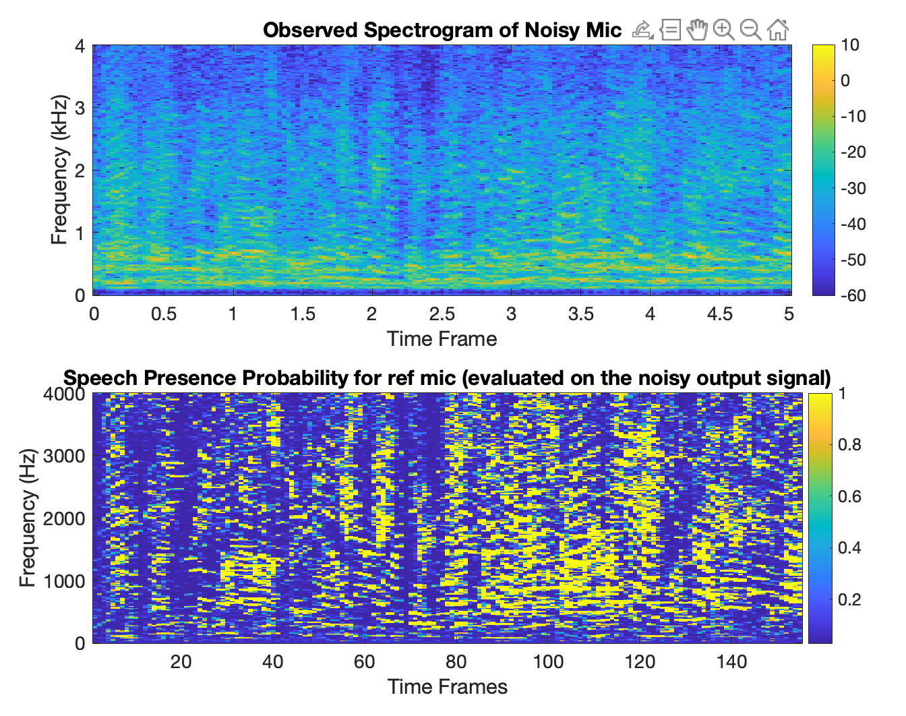
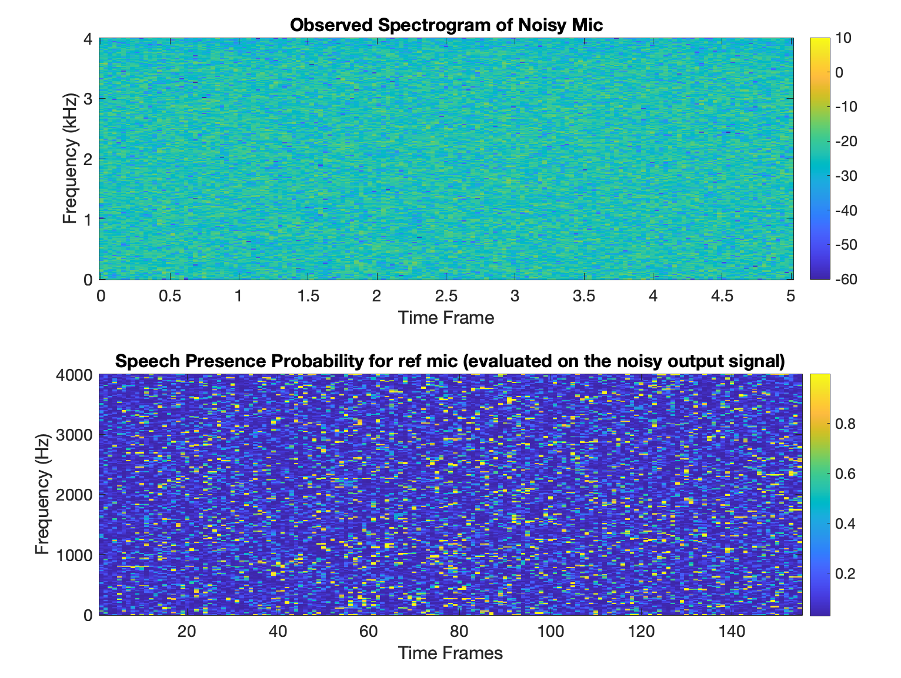
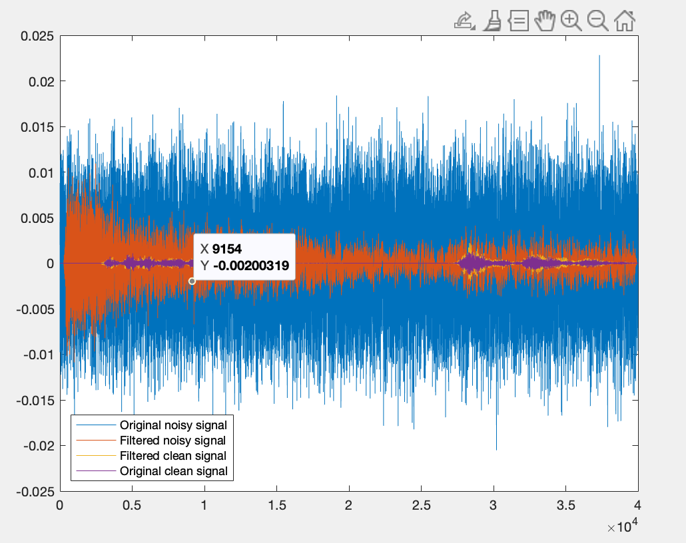
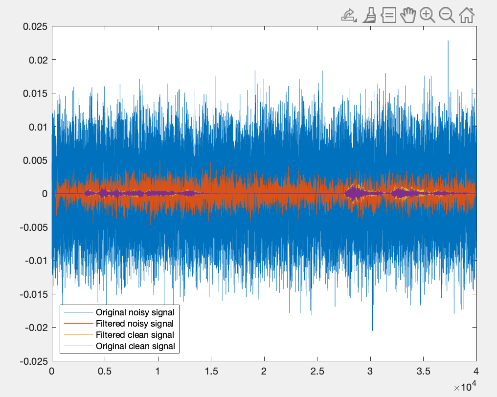

# Lab 3

### 3.1
1. How does this compare to the SPP for the speech-only signal? How does this differ between using a white noise signal or the babble noise as the noise source?
   1. I haven't actually run this to test, but I would imagine that the SPP for speech-only signal is quite high, whereas for noisy signal, not so much. Also, I would guess that white noise signal doesn't influence the SPP too much in the sense that it should still be identifiable in which segments is speech present and in which not. Babbel noise would change that, I imagine, and generate some false positives where there is no actual speech present in a segment, but because of the noise SPP would identify the noise as speech.
   1. I have run the test, it is mainly scattered around, not observing a SPP-like spectrogram. 
   1. Or, to say, babble noise is correlated to speech signal, making it hard ofr SPP to tell them apart. 

### 3.2
1. Observe the spectrogram of the enhanced speech signal. How does it compare to the noisy speech signal input?
   1. This can be shown in plot.

2. briefly introduce the MWF procedure and the GEVD
   1. note that there is an assumption that the speech and the noise are not correlated in MWF expressions ($E\{S(\omega)N^*_1(\omega)\}=0$) (DASP chapter 4 slide 28)
   2. the reason why we use GEVD instead of merely subtract the autocorrelation between observed signal and noise signal is that the result is a positive definite rank 1 matrix, which is not applicable for the scenario. slide 32-36
   3. 

### 3.3
1. How does this single-channel processing compare to the multi-channel case?
   1. I would imagine the multi-channel one is better

2. parameter influences

   1. SPP threshold

      1. SPP_thr = 0.95; Input SNR is 4.459998e-03 and output SNR is 1.902671e-01.
      2. SPP_thr = 0.8; Input SNR is 4.459998e-03 and output SNR is 1.120512e-01.
      3. 0.6 Input SNR is 4.459998e-03 and output SNR is 1.144856e-01.
      4. 0.3 Input SNR is 4.459998e-03 and output SNR is 1.050539e-01.
      5. explanation: get the noise out from speech. 

   2. forgetting factor

      1. lambda = 0.995 Input SNR is 4.459998e-03 and output SNR is 1.902671e-01.
      2. 0.9 Input SNR is 4.459998e-03 and output SNR is 5.204090e-02.
      3. 0.95 Input SNR is 4.459998e-03 and output SNR is 7.461586e-02.
      4. Observation: if the forgetting factor is smaller, then we cans see from the signal plot (in time domain) that there is a slow convergence speed uring the head. From the formula $\psi_{s\&n}=\lambda^2\psi_{s\&n}+(1-\lambda^2)Y(\omega)Y^H(\omega)$ we knwo that the frame estimation is highly related to the previous frame estimation. 

   3. input SNR

      1. uncorrelated 30 correlated 5:  Input SNR is 4.459998e-03 and output SNR is 1.902671e-01.
      2. 10 5 Input SNR is 3.203661e-01 and output SNR is 1.569137e+00.
      3. 

   4. FFT size

      1. 512: Input SNR is 4.459998e-03 and output SNR is 1.106836e-01.
      2. 256: Input SNR is 4.459998e-03 and output SNR is 1.902671e-01.
      3. 1024: Input SNR is 4.459998e-03 and output SNR is 1.001564e-01.
      4. result: increase on FFT size decerase SNR. why?

# Lab 4
### 4.1
1. Is there any constraint to consider for the placement of the noise source? 
   1. Noise needs to be further away from the mic than the loudspeakers. Otherwise the loudspeakers would need to generate anti-sound in the future (acausal) in order to negate the noise

1. Does e(n) go to zero, i.e. should we expect perfect cancellation upon convergence?
   1. The error doesn't go to zero. We cannot expect perfect cancellation. Not totally sure why exactly, but I would guess it has something to do with the secondary path. However, when I run our simulation and set the secondary path to be just impulse response (so it doesn't change the signal at all), the error still goes to zero. I think it's also because with a single channel, the filter simply can't completely adapt to the noise 'on the fly' in order to cancel it.

### 4.2
1. How does the convergence of the algorithm compare to the noise only case? How do you expect this would be affected in practice?
   1. We have much better results with the noise+speech. Because the noise gets quite well cancelled, the error is very small compared to the unchanged speech signal. In practice, this wouldn't be the case, since we would have to use estimates of h and not h itself (important when subtracting the speech signal in the error calculation)
   1. not answering the convergence problem. and I think the expectation is about convergence, not the h mis-estimation. 

### 4.3

1. Add the possibility to test the ANC in an actual 3D audio scenario. How does the scheme in fig. 2 need to be changed to achieve this?
   1. need to explain the effect of g
2. 
